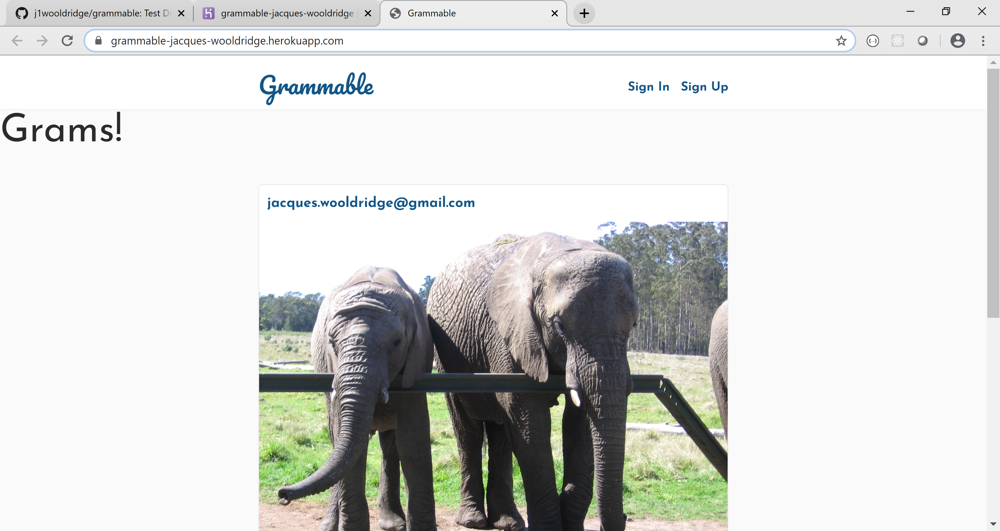

# README

An Instagram clone that was built using industry-standard, test-driven development following numerous red/green/refactor cycles. The goal was to build a app using html, css, javascript, Ruby, Ruby on Rails to highlight skills aquired as a full stack web developer.

Deployed Version

Visit https://grammable-jacques-wooldridge.herokuapp.com/ to deploy the app.

Screenshot Version

 

Jacques Wooldridge.